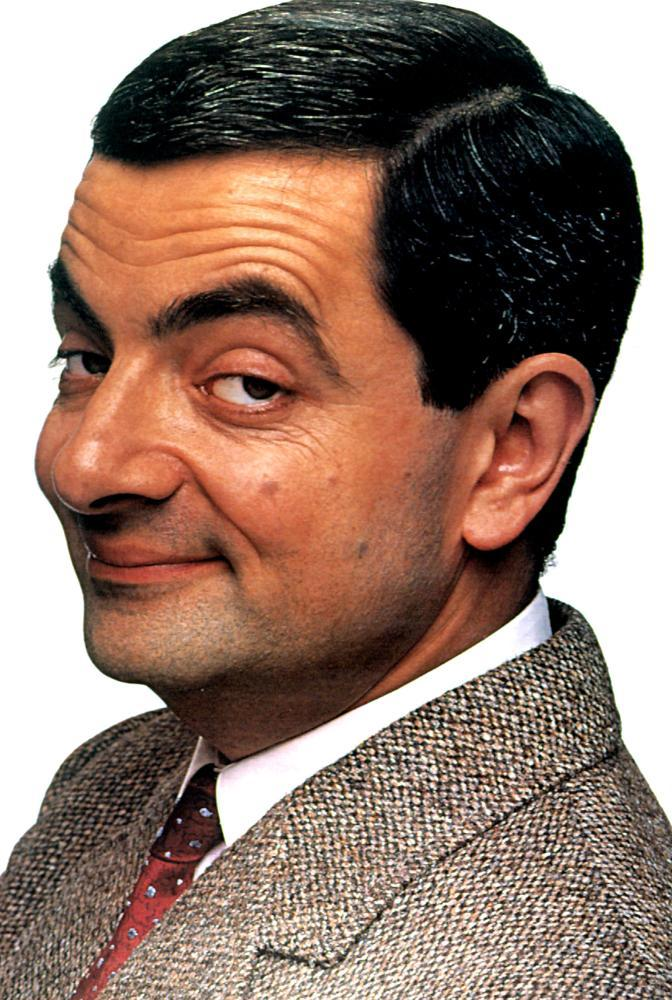

# Face Recognition using Teachable Machine

## Project Description
This project uses Google's Teachable Machine and Keras to classify two famous people:
- Mr. Bean
- Jackie Chan

## Test Image



## Result

```text
Class: Mr. Bean
Confidence Score: 0.9268901
